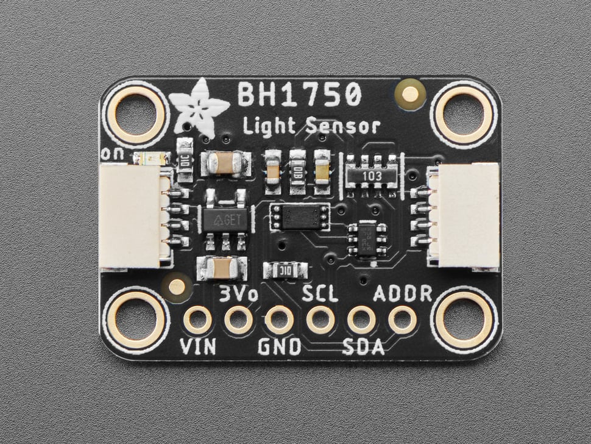
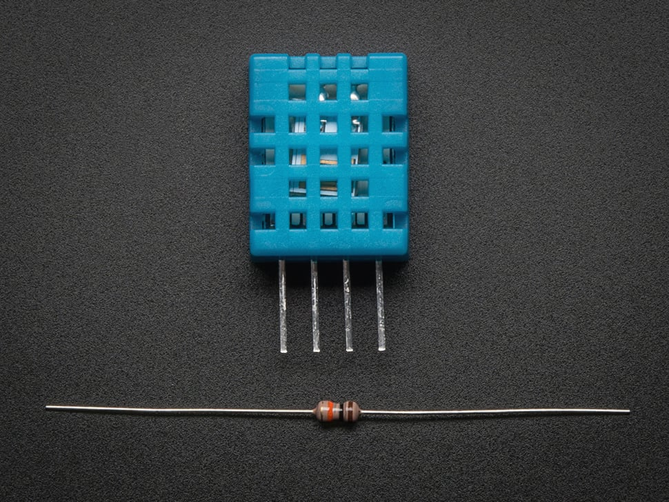
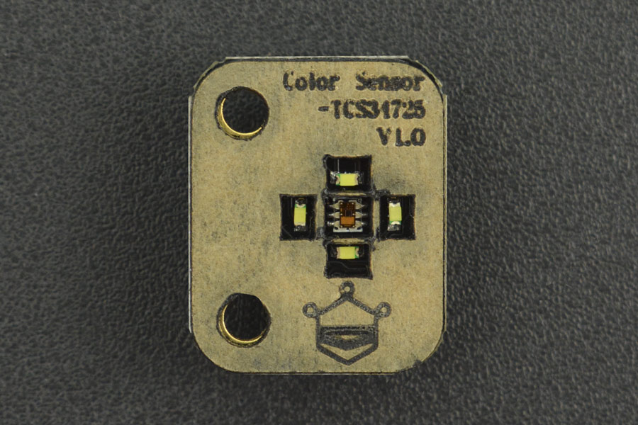
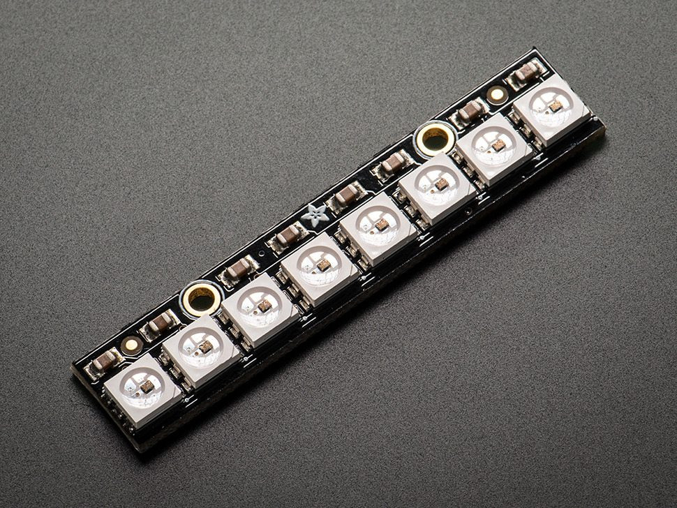
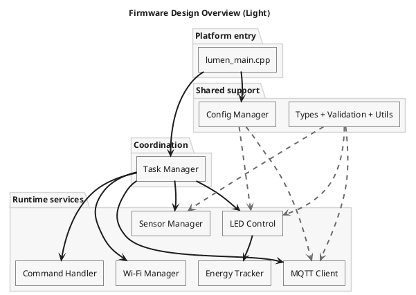
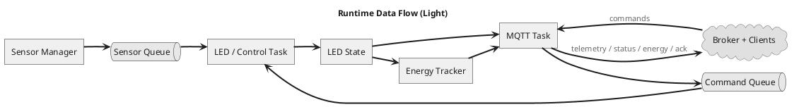
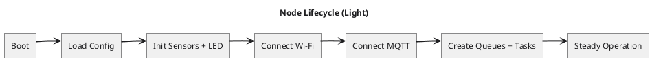
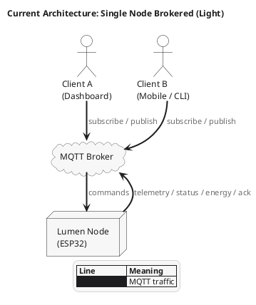
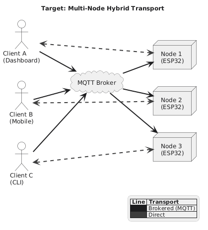
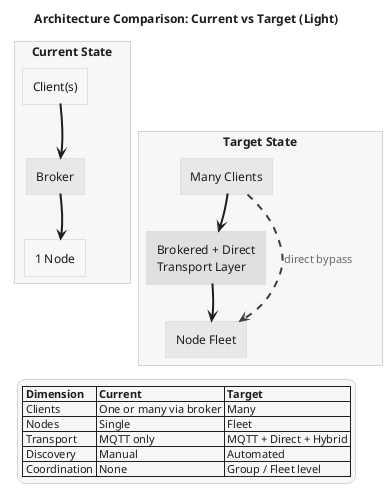

<p align="center">
  <picture>
    <source media="(prefers-color-scheme: dark)" srcset="assets/lumen-d.svg">
    
  </picture>
</p>

<p align="center">
  Lumen: A Node Firmware
</p>

Lumen is a local sensing and actuation node. It reads sensor data, drives output. Intended to be built generic by design. The goal is controlled-environment lighting, but the platform doesn't care what you point it at.

> **Work in progress.** The core is functional. Spectral sensing, direct mode, and multi-node support are not yet implemented.

## TL;DR

A general-purpose local sensing and actuation node. Structured to grow. Reads sensors. Drives output. Supports automatic and manual behavior, persistent settings, and MQTT-based control.

The longer-term goal is a platform one can keep extending without rebuilding the whole thing every time the hardware or the use case changes.

For now, this is just the baseline, kind of a POC.

Right now, it can:

- measure:
  - ambient light
  - temperature
  - humidity
- control:
  - LED lighting
  - automatic behavior
  - manual behavior
- report:
  - telemetry
  - status
  - energy data
  - online/offline state
- run:
  - on a local network
  - without cloud dependency

Important project files:

- [Makefile](./Makefile)
- [platformio.ini](./platformio.ini)
- [include/lumen_board_config.h](./include/lumen_board_config.h)
- [include/lumen_secrets.h](./include/lumen_secrets.h)
- [src/lumen_main.cpp](./src/lumen_main.cpp)

Jump to:

- [Implementation status](#implementation-status)
- [Firmware design](#firmware-design)
- [Technical discussion](#technical-discussion)
- [Roadmap](#roadmap)
- [MQTT interface](#mqtt-interface)

---

## What it does

A Lumen node watches its environment and reacts to it. It reads sensor data, drives LED output, tracks its own state, and gives other clients a clean way to observe or control it over the network.

In practical terms, that means it can measure ambient light, temperature, and humidity, then adjust lighting automatically or accept manual commands. It can also report whether it is online, publish telemetry and status updates, and keep track of basic energy-related behavior over time.

### Features

**Monitoring**
- monitor:
  - ambient light
  - temperature
  - humidity
  - current node status
  - online/offline state

**Lighting control**
- control:
  - LED output remotely
  - automatic lighting behavior
  - manual lighting behavior
- adjust:
  - brightness
  - channel distribution

**Configuration**
- configure:
  - operating mode
  - runtime behavior
  - thresholds and settings without reflashing

**Feedback and reporting**
- receive:
  - command acknowledgements
  - telemetry updates
  - status updates
  - energy usage data

**Connectivity**
- connect:
  - one node to one or many clients
  - multiple clients to the same node
- run:
  - on a local network
  - without cloud dependency

---

## Application context

Lumen sits in the space between embedded controls, environmental sensing, and lighting automation. One obvious use case is controlled-environment lighting, where the system needs to react to brightness, temperature, and humidity while still giving the user direct control when needed.

One obvious direction is spectrum-aware plant lighting, which is the current implementation. In that context, light is not only about brightness. Timing matters. Composition matters too. That overlaps with [photomorphogenesis](https://en.wikipedia.org/wiki/Photomorphogenesis), which describes how light influences plant growth and development.

This is still about the platform, not a paper with a repo attached to it. The repo already does useful work today. More advanced horticulture-specific behavior is planned (as what I really intended it to be), but it is not being oversold here.

---

## Implementation status

This is what is already done, what is planned next, and what a user can actually do with the system today.

### Done now

The current firmware already gives you a working local node.

- implemented today:
  - ambient light sensing
  - temperature and humidity sensing
  - LED control
  - autonomous brightness behavior
  - manual control
  - MQTT telemetry and commands
  - energy tracking
  - config persistence
  - online/offline reporting

For a user, that means you can:

- monitor:
  - light
  - temperature
  - humidity
  - node state
- control:
  - LED brightness
  - LED channel mix
  - operating mode
- observe:
  - telemetry
  - status updates
  - acknowledgements
  - energy-related data
- deploy:
  - locally
  - without cloud services

### Will be implemented

- planned next:
  - TCS34725 spectral sensing
  - RGB/Clear sensor data in the runtime model
  - spectrum-aware control logic
  - photoperiod scheduling
  - richer horticulture-focused behavior
  - direct transport mode
  - broader multi-node support

For a user, that later means you will be able to:

- use:
  - richer light-aware behavior
  - better control profiles
  - more flexible deployment modes
- manage:
  - more than one node
  - simpler local setups with fewer infrastructure assumptions
- get:
  - more meaningful lighting decisions
  - stronger alignment between sensing and light output

### What could possibly happen:

- Abandon
- Refactor

---

## Design priorities

The firmware is being built around a few simple priorities.

- local-first operation
- internet-independent deployment
- predictable embedded behavior
- clear separation of concerns
- practical hardware choices
- room to grow without rewriting everything

These priorities matter because they shape the code as much as the feature list does. The goal is not just to make something work once. The goal is to make something understandable, maintainable, and useful in real local setups.

---

## Platform components

Lumen is easier to describe by function first, then by exact part number.

At the platform level, it has a controller node, a sensor layer, an actuation layer, and a communication layer. That structure matters because the firmware should survive hardware changes over time, even if the current implementation uses specific modules today.

### Current core roles

- **Controller**
  - ESP32-based processing and connectivity node
  - handles logic, messaging, state, and runtime flow

- **Sensors**
  - ambient light sensing
  - temperature and humidity sensing
  - spectral light sensing

- **Actuation**
  - addressable LED lighting output

- **Connectivity**
  - local-network transport
  - client communication layer

- **Runtime services**
  - configuration persistence
  - command handling
  - telemetry and status reporting
  - energy tracking

---

## Current hardware profile

These are the concrete parts used now, plus the next planned sensor.

### Current components

- Controller: [ESP32 / ESP32-WROOM family](https://www.espressif.com/en/products/socs/esp32)
- Ambient light sensor: [BH1750](https://learn.adafruit.com/adafruit-bh1750-ambient-light-sensor)
- Temperature and humidity sensor: [DHT11](https://learn.adafruit.com/dht)
- LED output: [NeoPixel / WS2812B-compatible RGB LEDs](https://learn.adafruit.com/adafruit-neopixel-uberguide)

### Planned next sensor

- Spectral light sensor: [TCS34725](https://learn.adafruit.com/adafruit-color-sensors)











> TODO: finalize fritzing board.

---

## Firmware design

The firmware is split into focused modules so sensing, control, transport, and persistence do not collapse into one oversized loop. Each major concern has a clear home, and the runtime uses tasks and queues to keep those responsibilities separated.

### Core modules

- **Device and platform**
  - `lumen_main.cpp`
  - `lumen_board_config.h`
  - `lumen_app_types.h`

- **Connectivity**
  - `lumen_wifi_manager.*`
  - `lumen_mqtt_client.*`

- **Sensors and control**
  - `lumen_sensor_manager.*`
  - `lumen_led_control.*`
  - `lumen_energy_tracker.*`

- **Coordination**
  - `lumen_task_manager.*`
  - `lumen_command_handler.*`

- **Persistence and shared support**
  - `lumen_config_manager.*`
  - `lumen_system_utils.*`
  - `lumen_type_validation.*`

### Runtime responsibilities

- **Sensing**
  - read sensor values
  - validate readings
  - forward readings into the system

- **Control**
  - apply autonomous behavior
  - process manual commands
  - update LED output

- **Transport**
  - maintain Wi-Fi and MQTT connectivity
  - publish telemetry, status, energy, and acknowledgements
  - receive inbound commands

- **Persistence**
  - load runtime configuration
  - save updated state
  - keep device identity and energy totals

### Firmware design overview

This diagram shows the code organization without trying to show every function talking to every other function. It is grouped by role on purpose.

<picture>
  <source media="(prefers-color-scheme: dark)" srcset="./assets/diagrams/lumen-firmware-design-dark.png" />
  <source media="(prefers-color-scheme: light)" srcset="./assets/diagrams/lumen-firmware-design-light.png" />
  
</picture>

### Data flow

Sensor readings enter the system first. From there, they feed both the control path and the reporting path. Inbound commands take a different route, but they still end up affecting the same runtime state.

- sensor readings feed:
  - LED control decisions
  - telemetry publishing
- inbound commands feed:
  - command decoding
  - dispatch into control logic
  - acknowledgements
  - status updates
- runtime state feeds:
  - status reports
  - energy tracking
  - configuration persistence

<picture>
  <source media="(prefers-color-scheme: dark)" srcset="./assets/diagrams/lumen-runtime-flow-dark.png" />
  <source media="(prefers-color-scheme: light)" srcset="./assets/diagrams/lumen-runtime-flow-light.png" />
  
</picture>

### Task model

The runtime is split across dedicated tasks instead of being pushed into a single loop.

- **Sensor task**
  - reads current sensor values
  - forwards readings to the right consumers

- **LED/control task**
  - handles command application
  - updates lighting state
  - drives energy tracking

- **MQTT task**
  - maintains transport connectivity
  - publishes outbound data
  - processes inbound messages

That split matters because sensing, transport, and LED control all have different timing and failure modes. Queues keep those parts decoupled enough to stay manageable.

### Node lifecycle

A node follows a simple lifecycle. It boots, loads config, initializes hardware, brings up connectivity, then enters steady operation.

<picture>
  <source media="(prefers-color-scheme: dark)" srcset="./assets/diagrams/lumen-node-lifecycle-dark.png" />
  <source media="(prefers-color-scheme: light)" srcset="./assets/diagrams/lumen-node-lifecycle-light.png" />
  
</picture>

---

## Technical discussion

### Why local-first and internet-independent

Lumen is built so it does not depend on cloud services or an active internet connection. That matters in places where connectivity is unreliable, expensive, or simply not worth depending on. A farm, greenhouse, shed, grow room, or remote enclosure is exactly the kind of environment where local control makes more sense than cloud-first control.

The current design still uses local Wi-Fi and MQTT for remote visibility and control, but it does not need the public internet to function. Sensing, lighting behavior, and local-network operation stay inside your own environment.

### Why MQTT

[MQTT](https://mqtt.org/) fits this kind of node well. The device publishes status and telemetry, and it listens for commands. That is already the shape of the problem.

It also gives the platform a clean brokered model:

- one node can serve:
  - one client
  - many clients
- one broker can fan out:
  - telemetry
  - status
  - acknowledgements
- the node does not need to directly manage every consumer connection

That is why MQTT is the current default instead of direct mode.

### Why MsgPack

Lumen uses [MsgPack](https://msgpack.org/) instead of JSON for structured payloads. The reason is simple: it is compact, efficient, and better suited to resource-constrained firmware.

That helps with:

- smaller payloads
- less overhead on the wire
- less verbosity in serialized messages
- cleaner use of limited embedded resources

It still leaves the client side reasonably easy to decode.

### The sensor roles are separated

Ambient brightness, spectral composition, and environmental conditions are different signals. Lux is not the same thing as wavelength balance. Temperature and humidity are not the same thing as either of those.

Keeping the roles separate makes the system easier to reason about and easier to extend.

### BH1750 is enough for the current control loop

For the current firmware, BH1750 solves the immediate problem cleanly. It gives a stable lux reading, it is easy to integrate, and it is enough for brightness-based automatic behavior. If the current control loop is based on ambient intensity, BH1750 is the right sensor to get that working first.

### DHT11 is acceptable for now

DHT11 is not a precision environmental instrument, and it should not be treated like one.

But it is cheap, common, accessible, and easy to integrate.

Good enough for basic environmental context in a first practical build.

That makes it a reasonable current choice for:

- enclosure monitoring
- threshold-based awareness
- baseline environmental reporting

If tighter tolerances matter later, the platform can move to a better environmental sensor.

### TCS34725 is the next meaningful addition

BH1750 tells the node how bright the environment is. It does not tell the node anything about the composition of that light.

That is where [TCS34725](https://learn.adafruit.com/adafruit-color-sensors) comes in. It adds RGB and clear channel data. Once that exists in the sensor model, the platform can move beyond simple inverse-brightness behavior and start making spectrum-aware decisions. That is the point where the lighting logic becomes more interesting.

### Why WS2812B is fine for prototyping

[WS2812B / NeoPixel](https://learn.adafruit.com/adafruit-neopixel-uberguide) hardware is easy to drive from an ESP32, easy to source, and good for building the control stack quickly. That makes it a practical choice for platform work.

There is still a limit here:

- good for:
  - rapid prototyping
  - control logic development
  - UI and workflow development
- not ideal for:
  - calibrated spectral output
  - true far-red emission
  - stricter horticultural claims

Far-red, in particular, is still only approximated in this setup.

### Queue-based task separation

Transport, sensing, and control do not have the same timing needs. They also do not fail in the same way. Putting them all into one giant shared-state loop would make the code harder to reason about and harder to debug.

Queues help by:

- isolating responsibilities
- reducing direct coupling
- allowing one task to fail or stall without turning every module into shared spaghetti
- making data flow explicit

That is one of the key design decisions in the firmware.

### Why direct mode is planned, not primary

Direct mode is useful, especially for lighter local setups. But brokered mode comes first because it already solves multi-client observation cleanly and keeps the transport model simple.

Direct mode is still worth adding later for:

- smaller no-broker deployments
- lighter farm or greenhouse setups
- fewer infrastructure assumptions

It is just not the first transport problem to solve.

### Current limitations

The current implementation is still narrow in a few obvious ways.

- current limits:
  - single-node implementation
  - MQTT-only transport
  - no spectral sensing yet
  - no direct mode yet
  - RGB-based far-red approximation
- current strengths:
  - stable platform foundation
  - local-first architecture
  - clear module boundaries
  - working sensing, control, and reporting stack

That is a good place to be. It means the project has a base worth extending.

---

## Current design

The current design is simple on purpose: one node, one brokered transport path, one clean topic namespace, and a split between sensing, control, and reporting.

- single ESP32 node
- MQTT transport
- broker required
- one or many clients can connect through the broker
- per-node topic namespace
- [MsgPack](https://msgpack.org/) payloads
- local-network first

<picture>
  <source media="(prefers-color-scheme: dark)" srcset="./assets/diagrams/lumen-current-architecture-dark.png" />
  <source media="(prefers-color-scheme: light)" srcset="./assets/diagrams/lumen-current-architecture-light.png" />
  
</picture>

---

# Roadmap

Lumen is heading in two directions at once. One is depth: better sensing and better control on a single node. The other is breadth: more nodes, more deployment options, and cleaner client integration.

## Vision

Lumen is meant to become a node-based platform.

- one client can manage one or many nodes
- one node can be observed or controlled by one or many clients
- the system supports brokered communication and direct client-to-node communication

## Planned horticulture profile

The next meaningful feature track is spectrum-aware lighting support.

That includes:

- adding TCS34725 support
- extending the sensor model with RGB and clear channel data
- adding spectrum-aware lighting logic
- adding photoperiod scheduling
- adding threshold and alert behavior for controlled-environment use
- adding a horticulture-focused operating profile

## Platform growth

Past that, the platform can grow outward:

- multi-node orchestration
- multi-client shared observation and control
- node discovery and registration
- grouping and fleet-level coordination

## Infrastructure-light deployment

The platform should also get better at lighter local setups where internet is absent and infrastructure should stay minimal.

That means:

- improving behavior in no-internet environments
- reducing assumptions about always-on infrastructure
- supporting simpler farm and greenhouse local deployments
- adding direct mode for brokerless setups later

## Transport growth

MQTT stays. It already solves the current problem well.

Later on, the platform can add:

- direct transport mode for no-broker setups
- hybrid mode for mixed deployments
- transport abstraction so the control logic is not tied to one transport forever
- a cleaner client-facing SDK or API layer

## Target modes

- Brokered mode: many nodes to many clients through MQTT
- Direct mode: one or many clients to one node without a broker
- Hybrid mode: nodes can expose direct access while also participating in brokered orchestration

<picture>
  <source media="(prefers-color-scheme: dark)" srcset="./assets/diagrams/lumen-target-architecture-dark.png" />
  <source media="(prefers-color-scheme: light)" srcset="./assets/diagrams/lumen-target-architecture-light.png" />
  
</picture>

## Architecture comparison

<picture>
  <source media="(prefers-color-scheme: dark)" srcset="./assets/diagrams/lumen-architecture-comparison-dark.png" />
  <source media="(prefers-color-scheme: light)" srcset="./assets/diagrams/lumen-architecture-comparison-light.png" />
  
</picture>

| Dimension | Current | Target |
|---|---|---|
| Clients | One or many via broker | Many |
| Nodes | Single | Fleet |
| Transport | MQTT only | MQTT + Direct + Hybrid |
| Discovery | Manual | Automated |
| Coordination | None | Group / Fleet level |
| Spectral sensing | Not yet implemented | Planned |
| Horticulture profile | Partial | Targeted |

---

## MQTT interface

Lumen currently uses MQTT as its transport layer. Payloads use [MsgPack](https://msgpack.org/), while availability uses simple string values.

### Topic root

```text
lumen
```

### Device identity

Each node generates its own device ID.

Example:

```text
lumen-xxxxxxxxxxxx
```

### Published topics

```text
lumen/<device_id>/telemetry
lumen/<device_id>/status
lumen/<device_id>/energy
lumen/<device_id>/availability
lumen/<device_id>/ack/<command_id>
```

### Subscribed topics

```text
lumen/<device_id>/command/led
lumen/<device_id>/command/config
lumen/<device_id>/command/mode
```

### Payload format

- telemetry / status / energy / ack / command payloads: **MsgPack**
- availability payload: plain string `online` / `offline`

---

## Local deployment

Lumen is local-first. No cloud is required.

A typical setup looks like this:

```text
Lumen node <-> local Wi-Fi <-> local MQTT broker <-> local client/frontend
```

That already makes it usable in places where public internet access is unreliable or unnecessary, as long as local power and local network infrastructure exist.

---

## Component links

### Reference links

- [ESP32 family](https://www.espressif.com/en/products/socs/esp32)
- [BH1750 ambient light sensor](https://learn.adafruit.com/adafruit-bh1750-ambient-light-sensor)
- [DHT11 temperature and humidity sensor](https://learn.adafruit.com/dht)
- [TCS34725 color / spectral sensor](https://learn.adafruit.com/adafruit-color-sensors)
- [NeoPixel / WS2812B guide](https://learn.adafruit.com/adafruit-neopixel-uberguide)

### Where to buy

- [Makerlab Electronics](https://www.makerlab-electronics.com/)
- [CreateLabz Store](https://createlabz.store/)
- [Circuitrocks](https://circuit.rocks/)
- [TechTonics](https://www.techtonics.com.ph/)
- [e-Gizmo Mechatronix Central](https://www.e-gizmo.net/)

---

## Important project files

### Configuration
- [include/lumen_board_config.h](./include/lumen_board_config.h)
- [include/lumen_secrets.h](./include/lumen_secrets.h)

### Entry point
- [src/lumen_main.cpp](./src/lumen_main.cpp)

### Core modules
- [src/lumen_mqtt_client.cpp](./src/lumen_mqtt_client.cpp)
- [src/lumen_wifi_manager.cpp](./src/lumen_wifi_manager.cpp)
- [src/lumen_sensor_manager.cpp](./src/lumen_sensor_manager.cpp)
- [src/lumen_led_control.cpp](./src/lumen_led_control.cpp)
- [src/lumen_energy_tracker.cpp](./src/lumen_energy_tracker.cpp)
- [src/lumen_task_manager.cpp](./src/lumen_task_manager.cpp)
- [src/lumen_command_handler.cpp](./src/lumen_command_handler.cpp)
- [src/lumen_config_manager.cpp](./src/lumen_config_manager.cpp)

### Build / project files
- [Makefile](./Makefile)
- [platformio.ini](./platformio.ini)

---

## Development

For formatting, analysis, building, flashing, and monitoring, use:

- [Makefile](./Makefile)
- [platformio.ini](./platformio.ini)

---

## License

[GPL v3](./LICENSE)